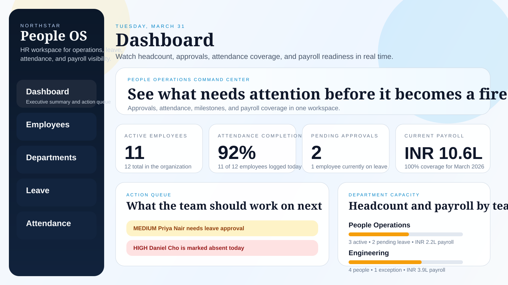
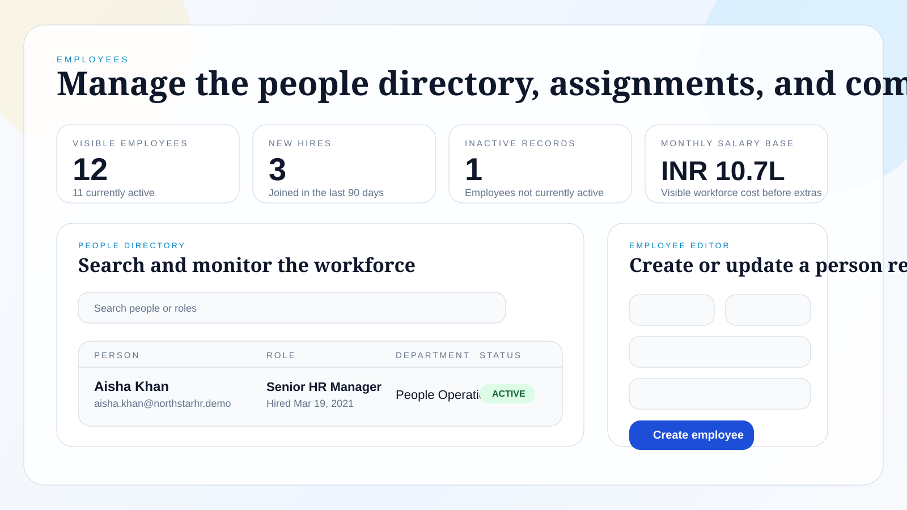

# Northstar People OS

Professional HRMS demo built with Spring Boot, Angular, and SQLite. It combines a modern people-operations dashboard with practical workflows for employees, departments, leave approvals, attendance, and payroll.

Recommended GitHub repository slug: `northstar-people-os`




## Why this repo is different

- A real executive dashboard, not just CRUD screens
- Synthetic seed data so the app feels complete on first run
- Environment-configurable demo credentials instead of hard-coded production secrets
- Cleaner repo hygiene with CI, ignore rules, and generated artifacts removed from source control
- A UI designed to feel closer to modern HR platforms like BambooHR and OrangeHRM

## Product capabilities

- Dashboard: workforce health, approval queue, attendance completion, payroll coverage, department capacity, and upcoming work anniversaries
- Employees: searchable people directory, status filters, compensation bands, department assignment, and profile editing
- Departments: org ownership, headcount distribution, payroll footprint, and manager coverage
- Leave: request creation, approval/rejection workflow, leave analytics, and approver attribution
- Attendance: daily records, exception monitoring, time validation, and operational metrics
- Payroll: monthly payroll runs, allowance/deduction handling, auto net-pay calculation, and current-cycle summaries

## Tech stack

- Backend: Spring Boot 3, Spring Security, Spring Data JPA, SQLite, Lombok
- Frontend: Angular 17, Angular Material, RxJS
- DevOps: GitHub Actions CI for backend tests and frontend build

## Quick start

### Backend

```bash
cd backend
mvn spring-boot:run
```

The API starts on `http://localhost:8080/api/v1`.

### Frontend

Use Node.js `18.13+` or `20+`.

```bash
cd frontend
npm install
npm start
```

The app runs on `http://localhost:4200`.

## Demo access

These are safe demo defaults and can be overridden with environment variables:

| Role | Username | Password |
| --- | --- | --- |
| Admin | `admin` | `admin123` |
| HR | `hr` | `hr123` |
| Employee | `employee` | `emp123` |

Environment variables:

- `HRMS_ADMIN_USERNAME`
- `HRMS_ADMIN_PASSWORD`
- `HRMS_HR_USERNAME`
- `HRMS_HR_PASSWORD`
- `HRMS_EMPLOYEE_USERNAME`
- `HRMS_EMPLOYEE_PASSWORD`
- `HRMS_DEMO_SEED`

## Demo data and privacy

- The seeded workforce is synthetic and generated locally on startup when the database is empty.
- `backend/hrms.db` is ignored from version control so local data is not committed accidentally.
- No API keys, tokens, or private employee records are intentionally stored in this repository.

## Validation

- Backend: `mvn test`
- Frontend: `npm run build`
- CI: `.github/workflows/ci.yml`

## Repository structure

```text
backend/   Spring Boot API, seed data, security, services, tests
frontend/  Angular application, dashboard, feature modules, UI shell
docs/      README assets and preview images
```

## Roadmap ideas

- Calendar-based leave planning
- Role-based permissions backed by persistent users
- Document center and onboarding tasks
- Performance review and goal tracking modules
- Reporting exports and audit logs
